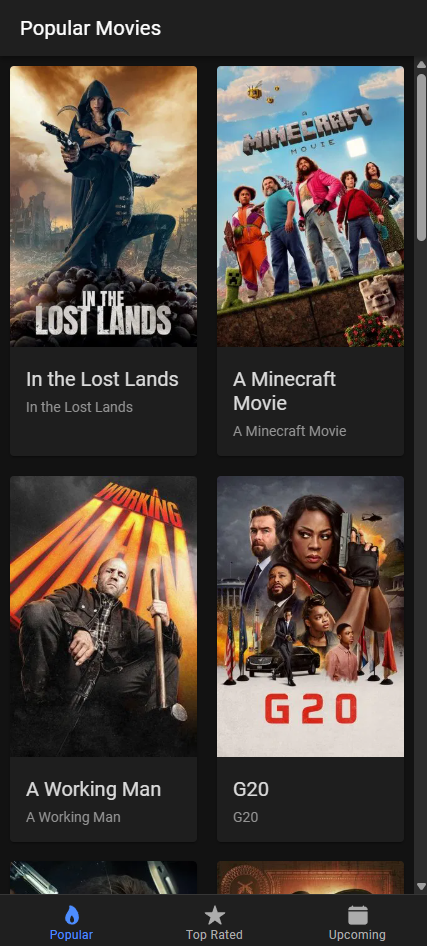
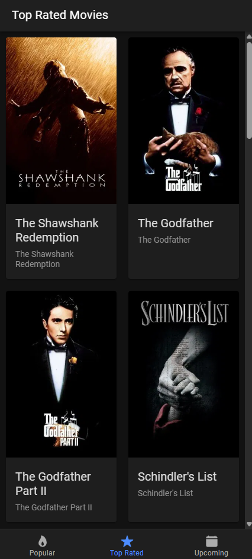
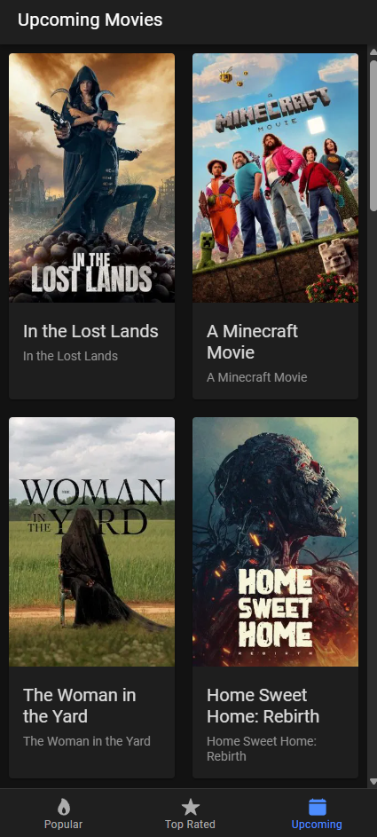

# 🎬 Ionic Movie App

A mobile-first movie browsing app built using [Ionic React](https://ionicframework.com/docs/react), fetching data from [The Movie Database (TMDB) API](https://www.themoviedb.org/documentation/api).

## ✨ Features

- Browse **Popular**, **Top Rated**, and **Upcoming** movies
- Uses TMDB API to fetch data
- Responsive grid layout using **CSS Grid**
- Smooth navigation with **Ionic Tabs**
- Built using **React + Ionic Framework**

---

## 📸 Screenshots

| Popular Movies                       | Top Rated                             | Upcoming                              |
| ------------------------------------ | ------------------------------------- | ------------------------------------- |
|  |  |  |

> (You can add screenshots in a `/screenshots` folder)

---

## 🚀 Getting Started

### 1. Clone the repository

```bash
git clone https://github.com/AbderrahmaneBr/MovieReviewAppIonic
cd MovieReviewAppIonic
```

### 2. Install dependencies

```bash
npm install
```

### 3. Add your TMDB API Key

Create a `.env.local` file in the root directory:

```env
VITE_API_KEY=your_tmdb_bearer_token
```

> You must use **VITE\_** prefix for environment variables to be exposed in Vite projects like Ionic React.

### 4. Start the development server

```bash
npm run dev
```

---

## 🔧 Project Structure

```
src/
├── components/
│   ├── MovieCard.tsx
│   └── MoviesLayout.tsx
├── lib/
│   ├── constants.ts
│   └── server.ts
├── pages/
│   └── Home.tsx
├── types/
│   └── movie.ts
│   └── response.ts
└── main.tsx
```

---

## 🧠 Tech Stack

- **Ionic React** – Mobile UI framework
- **TypeScript** – Strongly-typed React code
- **Vite** – Fast build tool
- **TMDB API** – Movie data provider

---

## 🙌 Acknowledgments

- [The Movie Database (TMDB)](https://www.themoviedb.org/)
- [Ionic Framework](https://ionicframework.com/)
